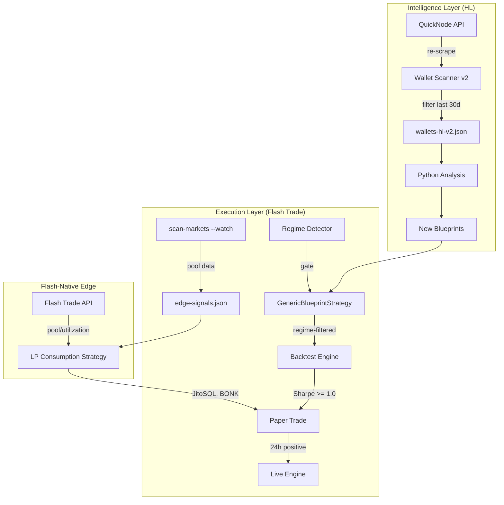

# Zekt Mission: Regime-Aware Strategy Discovery + Flash-Native Edge Hunt

## Onboarding

### What This Project Is
Zekt is an **autonomous strategy poaching system** that discovers profitable Hyperliquid wallets, reverse-engineers their strategies from fill-level data, and replicates them on Flash Trade (Solana perps). Pipeline: Research on Hyperliquid (rich data) → Execute on Flash Trade (Solana perps).

### Project Root
`/home/kt/zekt` — single Rust crate + Python analysis pipeline.

### Build & Test
```bash
cargo build --release         # Build Rust binary
cargo test                    # 181 unit tests (Rust)
python -m pytest analysis/tests/ -v  # 132 Python tests
```

### Key Files (Rust — `src/`)
- `strategy.rs` (5929 lines) — Strategy trait + 11 implementations + factory. **Read this first.** Contains `GenericBlueprintStrategy` (loads any cluster blueprint, 4 entry modes: momentum/mean-reversion/trend/grid). Has velocity auto-scaling via p90 percentile.
- `backtest.rs` — Hyperliquid candle fetcher + BacktestEngine. Replay through strategies.
- `paper.rs` — Paper trading engine (live prices, simulated PnL).
- `signal.rs` — MomentumDetector, MomentumSnapshot, Signal/ExitReason types.
- `engine.rs` — Live trading engine.
- `flash_api.rs` — Flash Trade REST client.
- `config.rs` — TOML config parser.
- `main.rs` — CLI (clap), routes to backtest/paper/dry-run/live.
- `src/bin/scrape-leaderboards.rs` — Wallet discovery via QuickNode HyperCore API.
- `src/bin/scan-markets.rs` — Rank Flash Trade markets by attractiveness.
- `src/bin/analyze-wallet.rs` — Classify wallet strategies, generate blueprints.

### Key Files (Python — `analysis/`)
- `position_clustering.py` — Cluster fills into open→close position cycles
- `wallet_metrics.py` — Per-wallet metrics (clip consistency, hold time, win rate, PnL)
- `strategy_classifier.py` — Classify wallets into strategy types
- `entry_reconstruction.py` — Reconstruct entry triggers from candle data
- `cluster_analysis.py` — Find groups of wallets running identical strategies
- `blueprint_generator.py` — Generate strategy blueprints from cluster statistics

### Data Files
- `data/wallets-hl.json` — 161 real profitable HL wallets (85MB)
- `data/blueprints/cluster-001.json` through `cluster-009.json` — 9 strategy blueprints
- `data/market-rankings.json` — 33 Flash Trade markets ranked by score
- `data/backtest-results/` — Backtest summary JSON + trade logs
- `config/perps.toml` — All tunable parameters (agent, flash, strategy, risk sections)

### Available Strategies (11 total)
`momentum-scalper`, `lp-consumption`, `mean-reversion`, `trend-follower`, `blueprint-scalper` (cluster-001), `blueprint-mean-revert` (cluster-004), `blueprint-cluster-002` through `blueprint-cluster-009` (generic, loads from blueprint JSON)

### What Just Happened (Previous Mission)
All 9 clusters backtested on BTC/SOL/ETH (Apr 15–May 22, 5m and 1m candles). **Result: zero pass Sharpe ≥ 1.0.** The wallets' edge was regime-specific and market-specific (WLD, REZ, ZRO, TON, 2Z). Even native-market tests showed negative Sharpe in this period. Auto-scaling was added to adapt velocity thresholds via p90 percentile — it activates for 6/7 clusters but doesn't create edge, just enables trading.

---

## Current Problem

**No strategy has transferable alpha on BTC/SOL/ETH in the current market regime.** Three root causes:
1. **Stale wallets** — The 161 wallets were scraped once. Their edge may have decayed. We need *currently* profitable wallets.
2. **Regime mismatch** — The clusters' parameters were calibrated in a different volatility regime. No mechanism detects when a strategy should activate/deactivate based on current conditions.
3. **Missing Flash-native opportunity** — Flash Trade has thin-book markets (JitoSOL #1 ranked, BONK 84% utilized) that don't exist on Hyperliquid. These are LP consumption edges waiting to be exploited.

---

## Mission: 4 Milestones

### M1: Re-Scrape Leaderboard for Currently Profitable Wallets (Rust)

**Goal:** Discover wallets that are profitable RIGHT NOW (last 30 days), not months ago.

**Changes to `src/bin/scrape-leaderboards.rs`:**
- Add `--time-window-days` flag (default: 30) that filters wallets by recent activity
- Add `--min-pnl-usd` flag (default: 500) to raise the bar for "profitable"
- Add `--output-comparison` flag that diffs against existing `data/wallets-hl.json` to identify:
  - New wallets not in the existing set
  - Wallets whose PnL changed significantly
  - Wallets that are no longer profitable
- Save results to `data/wallets-hl-v2.json` (don't overwrite v1)
- Output a `data/wallet-changes.json` with `{new: [...], still_profitable: [...], decayed: [...]}`

**Acceptance:** New wallet list with ≥50 wallets profitable in last 30 days. Change report showing which old wallets decayed.

### M2: Volatility Regime Detector (Rust)

**Goal:** Add a regime detection layer that gates strategy activation based on current market conditions matching the source cluster's statistical profile.

**New module: `src/regime.rs`**

```
RegimeDetector:
  - Rolling volatility (stdev of returns over lookback window)
  - ATR percentile (current ATR vs historical distribution)
  - Trend strength (SMA200 vs current price)
  
  Each cluster blueprint has a "regime fingerprint" derived from its
  statistical_parameters:
    - Source median hold time → implies expected volatility
    - Source TP/SL percentages → implies expected price range
    - Source win rate × avg_winner/avg_loser → implies expected regime

  Methods:
    - update(price, timestamp) — update rolling stats
    - is_compatible(cluster_id) -> bool — check if current regime matches cluster
    - regime_label() -> &str — "low_vol", "trending", "high_vol", "choppy"
```

**Integration into backtest loop:**
- Before each `detect_entry()`, check `regime.is_compatible(cluster_id)`
- Skip entry signals when regime doesn't match
- Log regime transitions for analysis
- Backtest results include `regime_filter: true` field

**Integration into GenericBlueprintStrategy:**
- Add `regime_compatible: bool` field, set by engine on each tick
- `detect_entry()` returns `NoSignal` when regime is incompatible
- Regime incompatibility is NOT the same as "no signal" — it's logged separately

**Acceptance:** Regime detector module with ≥10 unit tests. Backtest shows reduced trade count but improved Sharpe for compatible-regime trades.

### M3: Flash Trade Thin-Book Edge Exploitation (Rust)

**Goal:** Exploit LP consumption edge on Flash Trade-native markets (JitoSOL, BONK) that have high utilization and thin books.

**Enhance `lp-consumption` strategy in `strategy.rs`:**
- Current `LpConsumptionStrategy` already exists but hasn't been tested against real pool data
- Add flash-native market detection: markets with `flash_only: true` AND `utilization_pct > 30%` are prime targets
- Add market-specific config section `[strategy.flash-native]` in perps.toml

**Enhance `src/bin/scan-markets.rs`:**
- Add `--watch` flag for continuous monitoring mode (poll every 60s)
- Add `--edge-detection` flag that identifies markets where:
  - LP utilization is changing rapidly (>5% in last hour)
  - Available capacity is shrinking (LP being consumed)
  - A single LP holds >60% of the pool
- Output `data/edge-signals.json` with real-time opportunities

**Backtest Flash-native markets:**
- JitoSOL, BONK, SPY are Flash-only with decent utilization
- Run backtests using HL SOL candles as proxy (JitoSOL tracks SOL price)
- If Sharpe ≥ 1.0 on proxy data, proceed to paper trade on Flash Trade live

**Acceptance:** LP consumption strategy fires on live pool data. At least one Flash-native market shows positive gross PnL in paper trading.

### M4: Full Pipeline Re-Run + Validation (Rust + Python)

**Goal:** Run the complete discovery → analysis → implementation → validation pipeline with fresh data.

**Steps:**
1. Run re-scraped wallets (from M1) through Python analysis pipeline:
   ```bash
   cargo run --bin analyze-wallet -- --wallets data/wallets-hl-v2.json --output data/reports-v3/
   ```
2. This generates new blueprints in `data/blueprints/` (may overwrite old ones)
3. Run backtests on ALL strategies (old + new) with regime filtering (from M2):
   ```bash
   ./target/release/zekt --backtest \
     --strategies blueprint-cluster-002,...,blueprint-cluster-00N \
     --markets BTC,SOL,ETH,JUP \
     --backtest-start 2026-03-01 --backtest-end 2026-05-22 \
     --backtest-interval 5m --paper-balance 1000
   ```
4. Extended backtest window (90 days vs previous 21 days) captures more regimes
5. Any strategy with Sharpe ≥ 1.0 + regime filtering → paper trade 24h:
   ```bash
   ./target/release/zekt --paper --strategies <winner> --markets <market> --paper-balance 1000
   ```

**Acceptance:** Full pipeline produces at least one strategy with Sharpe ≥ 1.0 over 90 days, OR a documented explanation of why no edge exists in current market conditions (truth is valuable).

---

## Execution Order

| # | Task | Depends On | Estimated Effort |
|---|------|-----------|-----------------|
| 1 | M1: Re-scrape leaderboards with time filtering | None | Medium |
| 2 | M2: Regime detector module | None | Medium |
| 3 | M2: Integrate regime into GenericBlueprintStrategy + backtest | M2 module | Medium |
| 4 | M3: Flash-native LP consumption edge detection | None | Medium |
| 5 | M3: scan-markets continuous mode + edge signals | M3 | Medium |
| 6 | M4: Full pipeline re-run with fresh wallets + regime | M1 + M2 | Medium |
| 7 | M4: Extended 90-day backtest with regime filtering | M2 | Small |
| 8 | M4: 24h paper trade for any Sharpe ≥ 1.0 candidate | M4 | Small |

## Architecture: New Components



## Constraints
- All new Rust code uses `tracing` for logging, `anyhow::Result` for errors
- Python analysis follows existing module pattern (each module has `tests/test_<module>.py`)
- Don't break existing 181 Rust tests or 132 Python tests
- Config changes go in `config/perps.toml` with comments tracing to data source
- No live trading without explicit human approval
